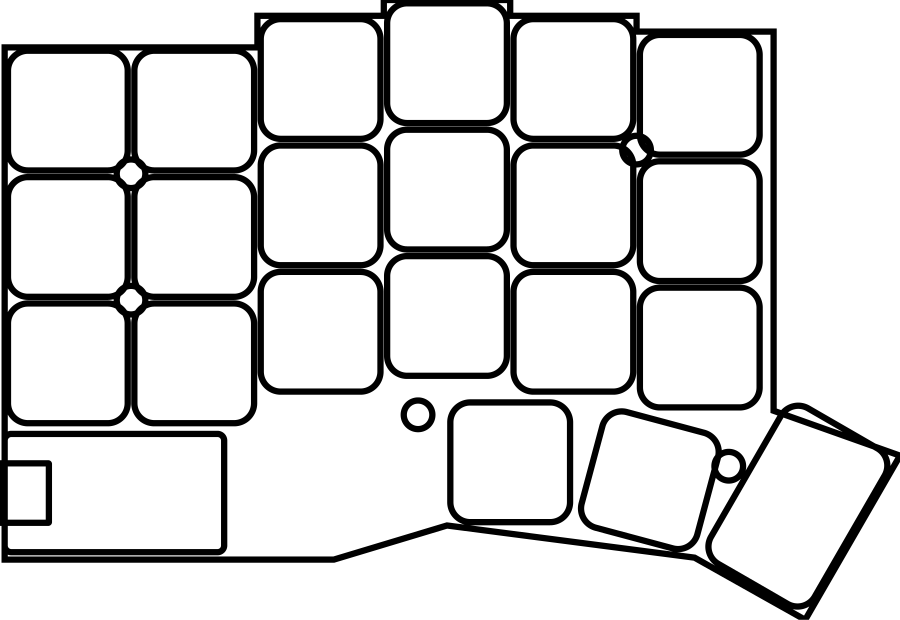

# Split keyboard (wireless, 3×6+3, Choc)

Беспроводная сплит-клавиатура по мотивам самодельной платы друга. Основа — конфиг wireless Corne для [Ergogen](https://ergogen.xyz).



## Структура
- `config.yaml` — геометрия, контур и футпринты (источник правды)
- `footprints/ceoloide/` — футпринты [ceoloide/ergogen-footprints](https://github.com/ceoloide/ergogen-footprints) (лицензия CC-BY-NC-SA-4.0, см. LICENSE внутри)
- `tools/plot_pcb.py` — QA-рендер `.kicad_pcb` в PNG без KiCad (контур + площадки)
- `docs/` — превью каждой версии
- `BOM.md` — список компонентов, `CHANGELOG.md` — история версий

## Генерация
Онлайн: вставить `config.yaml` на ergogen.xyz (футпринты ceoloide там встроены).

Локально (Node 20+, Python 3 + matplotlib):
```bash
npm install
npm run check   # → output/pcbs/corne_pcb.kicad_pcb и output/pcb_check.png
```

## Дальше
1. Решить открытые вопросы в `BOM.md`
2. Открыть `output/pcbs/corne_pcb.kicad_pcb` в KiCad 8, развести трассы, DRC
3. Экспорт gerber → заказ PCB
4. ZMK-конфиг прошивки (отдельный репозиторий или папка `firmware/`)
